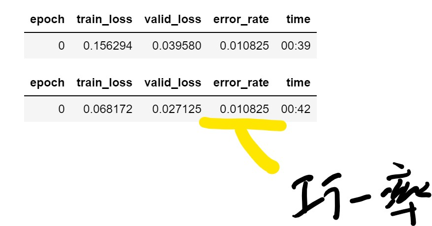

# Deep Learning Journey
## ディープラーニングへの旅路

この本で一番良いと思ったのは、いきなり難しい数学とか出てこないことです。  
  
なので、最初に数式の記載はまるでなく  
What you don't need,to do deep learningとして以下の記載がある。  

|  迷信  |  真実  |
|  ----  |  ----  |
|  大量の数字              | 高校数学で十分 |
|  大量のデータ            |  50要素未満でも記録破りの結果を出せる  |
|  大量の高価なコンピュータ |  無料で使えるもので最先端の結果が出せる  |

### ディープラーニングで最高の性能が達成されているタスク
* 自然言語処理(NLP:Natural Language Processing)：音声認識、文書要約
* コンピュータビジョン：写真の解析、顔認識、自動運転車両での車両検出
* 医学：レントゲン画像の異常検出
* 画像生成：白黒写真の色付け、画像からのノイズ除去
* 推薦システム：web検索、商品推薦
  
### ニューラルネットワークの簡単な歴史
いろいろな本に書かれておりますが、
ニューラルネットワークは人間の脳のニューロンをモデルとしており  
1943年にモデルが開発されています。  
しかし、一層のパーセプトロンではXOR(排他的論理和)が学習できない。  
これは多層にすることで回避できるのだが、その後発展しなかったとのこと。  
その後コンピュータのキャパシティが増大し、ニューロンの層が追加されて行って  
DeepLearningになっていったと。


### ディープラーニングの学び方
この本で特徴的なのがこの内容だと思う。  
ゲーム全体を教えること。  
つまり、野球を教える場合、野球観戦をして、実際にやることだ。  
ボールを作ったり、ボールとバットの摩擦係数を教えることでない！。  
なるほど。音楽を教えるのに、楽譜の読み方を教えるのでなく、楽器の弾き方を教えるのと同じだ。  
1. Play the whole game.
2. Make the game worth playing.
3. Work on the hard parts.

## The software
fastai,PyTorch,Python を使うとのことですが、現時点では私はpython以外はほとんどしらない・・。  

## さてJupyterで開始

で、Jupyterで進めるのだが、作業を進める前に、コピーして作成したほうが良いと、動画ではいっているので  
それで進めていきましょう。

```python:title
#id first_training
#caption Results from the first training
# CLICK ME
from fastai.vision.all import *
path = untar_data(URLs.PETS)/'images'

def is_cat(x): return x[0].isupper()
dls = ImageDataLoaders.from_name_func(
    path, get_image_files(path), valid_pct=0.2, seed=42,
    label_func=is_cat, item_tfms=Resize(224))

learn = cnn_learner(dls, resnet34, metrics=error_rate)
learn.fine_tune(1)
```

最初にこの内容で実行するのだが、何が書いてあるのか今一つ不明。  
で、実行すると以下が表示される。




さて、上記の実行した呪文はいったいなんだったのか？  

これはペット（猫と犬）の写真のデータセットを取得しているとな。  
1. fastaiデータセットコレクションから37種類の猫と犬を含む7,349枚の画像をダウンロードし解凍。
```python:title
path = untar_data(URLs.PETS)/'images'
```

2. 130万枚の画像を用いて訓練した訓練済モデルをダウンロード。
```python:title
learn = cnn_learner(dls, resnet34, metrics=error_rate)
```

3. 訓練済モデルを最新の転移学習技術を用いてファインシューン。
```python:title
learn.fine_tune(1)
```
